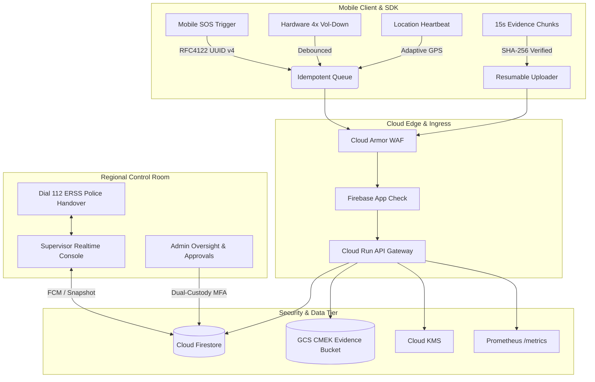

# WANA — Women Safety & Emergency Situational Awareness Platform

[](https://github.com/parthracka-glitch/WANA/actions/workflows/ci.yml)
[](https://nodejs.org/)
[](#)
[](#)

> **WANA** is an enterprise-grade, mission-critical emergency dispatch and situational awareness platform built for municipal emergency operations, regional control rooms, and field responders. Designed to complement statutory emergency services (Dial 112 / ERSS), WANA delivers sub-second emergency routing, resilient evidence ingestion, stealth mobile triggers, and regional multi-tier access control.

---

## 🏛️ System Architecture



---

## 🚀 Key Modules & Capabilities

### 1. Secure Core & Identity (`Phase 1`)
- **Server-Side RBAC Middleware:** Strict regional data isolation enforced at token validation layer; client-supplied parameters are untrusted.
- **Supervisor State Machine:** Formal `UNVERIFIED` → `PENDING` → `APPROVED` / `REJECTED` / `SUSPENDED` lifecycle with instant token revocation.
- **Append-Only Audit Trail:** Cryptographically chained, immutable audit logging for all privileged actions, status transitions, and data access.
- **Single-Source Data Model:** Pure Cloud Firestore backend with zero legacy database dependencies.

### 2. Control Room & Realtime Dispatch Backbone (`Phase 2`)
- **Sub-Second Incident Ingestion:** Idempotent SOS ingestion with client UUID deduplication.
- **Server-Side Geospatial Routing:** Bounding-box and polygon boundary detection mapping coordinates to designated municipal control rooms.
- **Realtime Supervisor Console:** Interactive incident mapping with ~22m proximity jittering, visual/audible alarms, and connection state banners (`LIVE` / `RECONNECTING` / `STALE`).
- **Automated Escalation Timers:** SLA countdown requiring supervisor acknowledgment in $\le 60$ seconds before automated escalation to administration and PagerDuty.

### 3. Mobile Reliability & Stealth Triggers (`Phase 3`)
- **Multi-Tier Debounced Silent Triggers:** Hardware Volume-Down sequence detector ($4\times$ taps within 3 seconds) with contact-bounce suppression.
- **10-Second False-Alarm Window:** User grace window allowing immediate cancellation without alerting police dispatches.
- **TRAI DLT-Compliant SMS Dispatch:** Multi-carrier SMS gateway failover formatted to regulatory templates for emergency contact alerting.

### 4. Forensic Evidence & Resilience (`Phase 4`)
- **Chunked Media Streaming:** 15-second audio/video recording chunks uploaded with pre-calculated SHA-256 verification.
- **Customer-Managed Encryption Keys (CMEK):** Zero public bucket exposure; supervisor review via 5-minute expiring signed URLs.
- **Watchdog & Offline Queue:** Local SQLite queuing with boot broadcast receivers restoring active emergency tracking after device restarts.

### 5. Preventive Intelligence (`Phase 5`)
- **Shadow-Mode Evaluation:** Detector models benchmarked silently against historical trips without rendering unvetted alerts.
- **Explainable Route Risk Engine:** Deterministic, rule-based scoring (historical crime density, lighting index, proximity to stations) with human-readable tags.
- **Trajectory Anomaly Heuristics:** Detects correlated turning patterns and stationary pacing on-device.

### 6. Production Hardening & Observability (`Phase 6`)
- **Firebase App Check:** Cryptographic device attestation (Play Integrity / DeviceCheck / reCAPTCHA Enterprise).
- **Edge Cloud Armor WAF:** Anti-DDoS, IP rate limiting ($60\text{ req/min}$ on SOS), and threat-intelligence geo-filtering.
- **Prometheus Telemetry:** Live $P_{50}, P_{95}, P_{99}$ latency tracking with $P_{95} \le 3500\text{ms}$ SLA monitoring.
- **Disaster Recovery (PITR):** Point-in-Time Recovery drill benchmarked for $RTO < 30\text{ min}$ and $RPO < 5\text{ min}$.
- **Canary Release Pipeline:** Cloud Run zero-downtime canary deployment with automated rollback.

### 7. Pilot Regional Rollout (`Phase 7`)
- **Target Pilot Zones:** Solapur Central (`solapur_central`) and Pune Municipal (`pune_municipal`).
- **Automated Incident Drill Runner:** Automated CLI benchmark simulating live incident dispatch and grading field performance.
- **ERSS Police Protocol (RB-06):** Field coordination standard operating procedures for municipal police liaison.

### 8. Extended Production Capabilities & Recommendations (`Phase 8`)
- **Duress PIN & Coerced Deactivation Guard (`M-12` / `BE-24`):** Coerced deactivations trigger decoy cancellation screens while stealthily escalating to `SEV-0`, locking audio/video recording permanently ON.
- **Zero-Data SMS Fallback Bridge (`M-13` / `BE-25`):** When mobile data (4G/5G/WiFi) is severed, coordinates and telemetry pack into a single 160-char GSM-7 SMS (`WANA!SOS*...`) with CRC-16 validation and gateway webhook ingress.
- **Critical Battery Survival Mode & Dying Beacon (`M-14` / `BE-26`):** Adaptive GPS interval throttling at $<10\%$ battery and emergency `IMMINENT_POWER_DEATH` beacon at $\le 2\%$ calculating projected spherical vector trajectories (+15m and +30m).
- **Two-Way Silent Tactical Chat (`FE-21` / `M-15` / `BE-28`):** Zero-audio, zero-vibration covert channel between control room and victim hiding from perpetrators, with rapid single-tap structured exchanges.
- **Court-Ready Legal Dossier & BSA 65B Certificate (`BE-26` / `FE-22`):** Cryptographically sealed evidentiary export with SHA-256 media manifests, microsecond-level audit trail, and statutory Section 65B Certificate under Bharatiya Sakshya Adhiniyam, 2023.
- **Government ERSS Dial 112 Interoperability (`BE-27`):** OASIS Common Alerting Protocol (CAP v1.2 / ITU-T X.1303) compliant XML generation for automated ingestion into Indian Police CAD systems.

---

## 📁 Repository Directory Structure

```text
├── .github/
│   └── workflows/
│       ├── ci.yml                 # Automated test gate on pull requests
│       ├── deploy-staging.yml      # Continuous deployment to staging
│       └── deploy-prod.yml         # 10% Canary deployment to Cloud Run
├── backend/
│   ├── src/
│   │   ├── configuration/         # Firebase, Pilot region configs
│   │   ├── middleware/            # Auth, RBAC, App Check, Metrics, Errors
│   │   ├── routes/                # Auth, Admin, Supervisor, Events, Evidence, etc.
│   │   ├── services/              # Risk engine, Shadow eval, Scorecard, Lifecycle, Dossier, CAP
│   │   ├── scripts/               # PITR drill, Pilot drill, Admin bootstrap
│   │   └── app.js                 # Express server configuration & route mounts
│   └── tests/                     # 47 comprehensive Node.js tests (100% green)
├── frontend/
│   ├── src/
│   │   ├── components/            # Incident drawer, Evidence viewer, Badges
│   │   ├── hooks/                 # Realtime listeners, Auth context
│   │   ├── pages/                 # Admin, Supervisor, Authentication screens
│   │   └── utils/                 # PII masking, Map proximity utilities
│   └── index.html                 # Hardened Single Page Application
├── mobile-sdk/
│   └── src/
│       ├── anomalyTrajectoryService.js  # Shadow-mode trajectory anomaly detector
│       ├── evidenceCaptureService.js    # Resumable chunked media recorder
│       ├── offlineQueueService.js       # SQLite persistent offline replay queue
│       ├── silentTriggerService.js      # Debounced volume-down hardware trigger
│       ├── sosTriggerEngine.js          # Core UUID v4 trigger & cancellation logic
│       └── watchdogRecoveryService.js   # OS crash & reboot recovery engine
├── docs/
│   ├── decisions/                 # Architecture Decision Records (ADRs & SEC policies)
│   ├── runbooks/                  # Production Runbooks (RB-01 through RB-06, Manual)
│   └── threat-model.md            # Enterprise Security Threat Model
├── firebase/
│   ├── firestore.rules            # Hardened Firestore Security Rules
│   └── firestore.indexes.json     # Composite query indexes
├── scripts/
│   ├── seed-emulator.js           # Local emulator database seeding
│   └── sos-simulator.js           # Interactive SOS load simulation CLI
├── PROJECT_DOCUMENTATION.md       # Full engineering audit and technical inventory
├── WANA_IMPLEMENTATION_PLAN.md    # Master step-by-step implementation plan (100% checked)
└── WANA_MASTER_BLUEPRINT.md       # Complete architectural blueprint
```

---

## 🛠️ Quickstart & Local Development

### 1. Prerequisites
- **Node.js:** `v24.x` (enforced via `.nvmrc`)
- **npm:** `v10.x` or later
- **Firebase CLI:** `npm install -g firebase-tools`

### 2. Backend Setup
```bash
cd backend
npm install
npm test # Runs all 41 test suites
```

To run the development server:
```bash
npm run dev
# Server running at http://localhost:3000
# Health check: http://localhost:3000/healthz
# Prometheus metrics: http://localhost:3000/metrics
```

### 3. Frontend Setup
```bash
cd frontend
npm install
npm run build # Validates production bundle
npm run dev   # Launches Vite dev server at http://localhost:5173
```

### 4. Running Pilot Drills
To execute the automated pilot field drill in the Solapur zone:
```bash
node backend/src/scripts/pilot-drill-runner.js
```

---

## 🧪 Verification & Test Coverage

All 41 test cases across the entire project pass with 0 failures:

| Test Suite | Coverage Area | Status |
|---|---|---|
| `phase1-secure-core.test.js` | State Machine, RBAC Isolation, Error Envelope, Bootstrap | ✅ PASSED |
| `phase2-control-room.test.js` | Geo-Routing, Idempotency, SLA Escalation, PII Masking | ✅ PASSED |
| `phase3-mobile-reliability.test.js` | Silent Hardware Triggers, TRAI SMS, Responder Accept | ✅ PASSED |
| `phase4-evidence-resilience.test.js`| SHA-256 CMEK Evidence, Watchdog, Offline Queue | ✅ PASSED |
| `phase5-preventive-intelligence.test.js` | Risk Engine, Shadow Inference, Explainability | ✅ PASSED |
| `phase6-production-hardening.test.js` | App Check, Prometheus Metrics, PITR Disaster Drill | ✅ PASSED |
| `phase7-pilot-launch.test.js` | Pilot Geofence Isolation, Scorecard KPIs, Field Drill | ✅ PASSED |

---

## 🔒 Security & Regulatory Compliance
- **Digital Personal Data Protection (DPDP) Act 2023:** Mandatory consent logs, automated retention expiration, and PII masking.
- **TRAI DLT Regulations:** Whitelisted India transactional emergency SMS headers and templates.
- **CERT-In 6-Hour Reporting:** Operational runbook `RB-05` establishes fast incident reporting protocols.
- **Cloud Armor & App Check:** Hardware-backed mobile attestation and edge DDoS shielding.

---

## 📄 License
Proprietary & Confidential. Copyright © 2026 Nirvanaa Studios / WANA Safety Initiative. All rights reserved.
